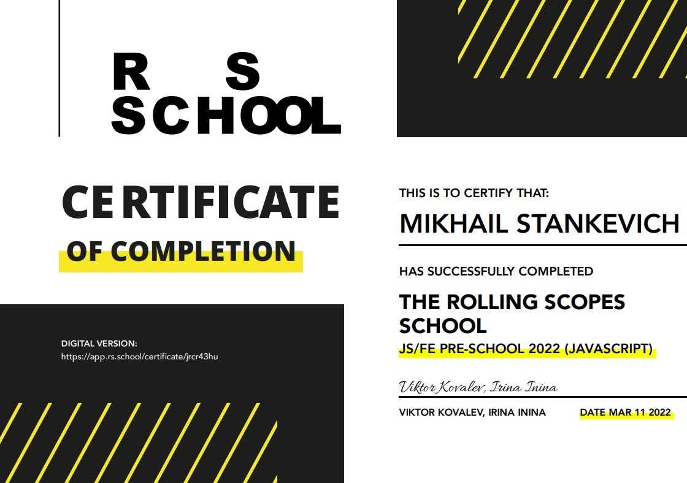

# Mikhail Stankevich #
## Frontend Developer ##
---
### About me ###
I'm 24 years old and I'm begining JavaScript Developer. My goal is to find a job and take part in big projects to get expirience. I hope that programming will help me to create something useful for people.

---
### Skills ###
* HTML5, CSS3
* JavaScript Basics
* Git, GitHub
* VS Code
---
### Education ###
* [Roling Scopes School (Stage 0)](https://rs.school/js-stage0)
* [Modern JavaScript Textbook](https://learn.javascript.ru) (In Progress)
#### Certificates ###


---
#### Code Example ####
A kata from CodeWars: Create a function 'finalGrade', which calculates the final grade of a student depending on two parameters: a grade for the exam and a number of completed projects.
```
const finalGrade = (exam, projects) => {
  if (exam > 90  || projects > 10) {
    return 100;
  } else if (exam > 75 && projects >= 5) {
    return 90;
  } else if (exam > 50 && projects >= 2) {
    return 75;
  } else {
    return 0;
  }
}